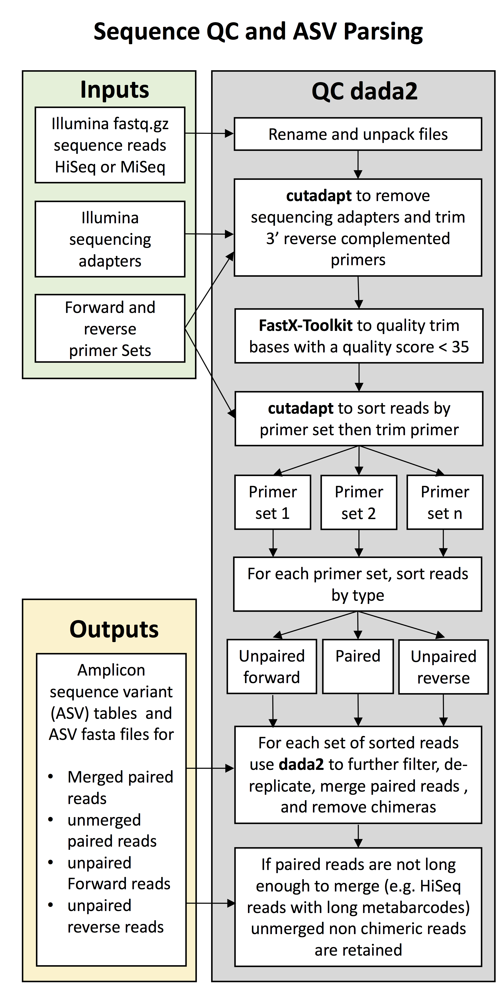
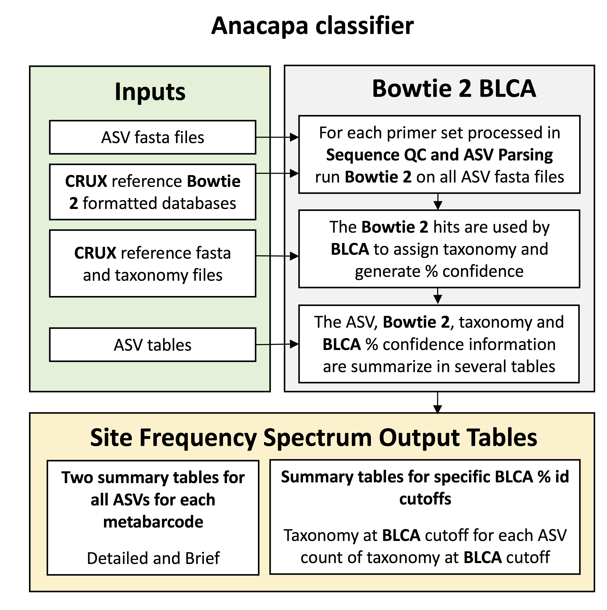

<p align="center">

</p>

# The Anacapa Toolkit
### last updated 11-06-2018

#### Written by Emily Curd (eecurd@g.ucla.edu), Jesse Gomer (jessegomer@gmail.com), Gaurav Kandlikar (gkandlikar@ucla.edu), Zack Gold (zjgold@ucla.edu), Max Ogden (max@maxogden.com), Lenore Pipes lpipes@berkeley.edu), and Baochen Shi (biosbc@gmail.com).

#### Developed at UCLA for the University of California Conservation Consortium's CALeDNA Program (http://www.ucedna.com/)

## Introduction
__Anacapa__ is an eDNA toolkit that allows users to build comprehensive reference databases and assign taxonomy to raw multilocus metabarcode sequence data. It address longstanding needs of the eDNA for modular informatics tools, comprehensive and customizable reference databases, flexibility across high-throughput sequencing platforms, fast multilocus metabarcode processing, and accurate taxonomic assignment. __Anacapa__ toolkit processes eDNA reads and assigns taxonomy using existing software or modifications to existing software. This modular toolkit is designed to analyze multiple samples and metabarcodes simultaneously from any Ilumina sequencing platform. A significant advantage of the __Anacapa__ toolkit is that it does not require that paired reads overlap, or that both reads in a pair pass QC. Taxonomy results are generated for all read types and the user can decide which read types they wish to retain for downstream analysis.

## High Level overview

__Anacapa__ includes four modules:

1) building reference libraries using [__CRUX__](https://github.com/limey-bean/CRUX_Creating-Reference-libraries-Using-eXisting-tools)
2) running quality control (QC) and assigning Amplicon Sequence Variants (ASV) using Dada2 (Sequence QC and ASV Parsing),   
3) assigning taxonomy using Bowtie 2 and a Bowtie 2 specific Bayesian Least Common Ancestor (BLCA) (Assignment) and   
4) Running exploratory data analysis and generating ecological diversity summary statistics for a set of samples using [ranacapa](https://f1000research.com/articles/7-1734/v1).  

#### Step 1: CRUX: Creating Reference libraries Using eXisting tools

For full details on building reference libraries using CRUX, please refer to the CRUX Github Repository: https://github.com/limey-bean/CRUX_Creating-Reference-libraries-Using-eXisting-tools.

This first part of the Anacapa toolkit uses __CRUX__ to generate reference libraries needed for taxonomic assignment.  Briefly,the output of __CRUX__ consists of two reference libraries, either unfiltered or filtered. Unfiltered libraries contain every dereplicated read found during BLAST searches. The filtered library contains only reads with robust taxonomic assignments. Specifically we refer to robust taxonomic assignments as any reads that do not have the following in their taxonomic path: 'uncultured', 'environmental', 'sample', or 'NA;NA;NA;NA'. Prebuilt __CRUX__ reference libraries (12S - MiFish, 16S - EMP, 18S V4, 18S V8-9, 18S - EMP, PITS - Plant ITS2, CO1 and FITS - Fungal ITS) [see Table 1] are available on [Google Drive](https://drive.google.com/drive/folders/0BycoA83WF7aNOEFFV2Z6bC1GM1E?usp=sharing)), and will be uploaded to Dryad upon acceptence of the Anacapa manuscript. Each library contains unique metabarcode specific reads that correspond to NCBI accession version numbers. Libraries consist of fasta files, taxonomy files, and a Bowtie 2 index library.

<p align="center">

</p>

We acknowledge that users may wish to use their own custom sequences libraries to run __Anacapa__ or add additional custom sequences to a pre-made __CRUX__ reference library. Please refer to the __CRUX__ page (https://github.com/limey-bean/CRUX_Creating-Reference-libraries-Using-eXisting-tools) for instructions to create a library from a custom set of fasta formatted reads or add reads to a CRUX formatted reference library.

#### Step 2: Sequence QC and ASV Parsing using dada2

<p align="center">

</p>

This next step of the toolkit aims to conduct standard sequence QC and generate amplicon sequence variants (ASV) from Illumina data using **dada2** (Callahan et al. 2016). ASVs are a novel solution to identifying biologically informative unique sequences in metabarcoding samples that replaces the operational taxonomic unit (OTU) framework. Unlike OTUs, which cluster sequences using an arbitrary sequence similarity (ex 97%), ASVs are unique sequence reads determined using Bayesian probabilities of known sequencing error. These unique sequences can be as little as 2 bp different, providing improved taxonomic resolution and an increase in observed diversity. Please see (Callahan et al. 2016, Amir et al. 2017) for further discussion.

A key advantage of the __Anacapa__ toolkit is that is can simultaneously processes raw fastq reads for samples with single or multiple metabarcode targets generated on Illumina HiSeq and MiSeq machines. It is also not required that all samples contain reads for each metabarcode, thus allowing users to combine multiple projects or targets on the same sequencing run while only running the pipeline once.

__Anacapa__ takes raw **demultiplexed** Illumina fastq format reads (e.g. each sample has a pair of forward and reverse fastq files) and preprocesses them to assess file corruption (md5sum) and uncompresses and renames the files for readability. The QC portion of this script trims nextera and truseq adapters, removes low quality reads, and sorts reads by metabarcode primer sequence. Reads are trimmed using **cutadapt** (Martin 2011) to remove sequencing adapters from the 5' ends and sequencing adapters and primers from the 3' ends of reads.  **Fastx-toolkit** (Gordon and Hannon, 2010) is then used for quality control. Reads are retained if they have a Q ≥ 35 and are at least 100bp after adapter and 3' primer trimming. **cutadapt** is next used to sort reads by primer, and to trim additional basepairs from the end of read to increase quality going into **dada2**. Prior to running **dada2**, a custom python script sorts reads into unpaired Forward, unpaired Reverse, and unmerged read files.  The files are passed separately into **dada2**, where sequences are denoised, dereplicated, merged (where possible), and chimeric sequences removed from the data set.  


The input is raw Illumina metabarcode sequence data `[\*.fastq.gz]` reads, and outputs are summary tables of ASVs and taxonomy count data for multiple samples and metabarcodes (ASV table). Successful implementation of this step requires: 1) raw illumina sequencing data and 2) a set of fasta formatted files for the forward and reverse metabarcoding primers used to generate sequence data.

#### Step 3: Taxonomic Assignment using Bowtie 2 and BLCA

<p align="center">

</p>

This next module of the Anacapa toolkit assigns taxonomy to ASVs using **Bowtie 2** and a Bowtie 2 specific **Bayesian Least Common Ancestor** (**BLCA**) algorithm.

The **Anacapa** toolkit determines the best taxonomic hits for an ASV using **Bowtie 2** (Langmead and Salzberg, 2012). **Anacapa** considers paired merged, paired unmerged, and unpaired sequencing reads, and thus a fast and flexible read aligner, such as Bowtie 2, is required to handle all four read types.  

All ASVs are first globally aligned against the **CRUX** database using **Bowtie 2**. Any ASV that fail to align are then aligned locally. The best hits (the top 100 **Bowtie 2** returns) are then processed with **BLCA** script to assign taxonomy. The **Bowtie 2 BLCA** algorithm was adapted from https://github.com/qunfengdong/BLCA. **BLCA** uses pairwise sequence alignment to calculate sequence similarity between query sequences and reference library hits. Taxonomy is assigned based on the lowest common ancestor of multiple reference library hits for each query sequence. The reliability of each taxonomic assignment is then evaluated through bootstrap confidence scores [Gao et al. 2017].

Successful implementation of this script requires an ASV table (summary table) with the following columns : ASV number, Sequence, and one column for each sample in the study. The output is multiple ASV tables for each metabarcode, and both global and local alignments.


#### Step 4: ranacapa: Data exploration
This portion generates ecological diversity summary statistics for a set of samples (Kandlikar et al. 2018).

The last step of the **Anacapa** Pipeline conducts exploratory data analysis to provide a first pass look at sequencing depth, taxonomic assignments, and generated data tables. This analysis is not meant for publication, but solely as a first stab at visualization of your data. This is helpful in identifying potential glaring errors or contamination, and identifying patterns worth investigating further through more robust analysis. We highly encourage data exploration before further analysis as different parameters within the **Anacapa** pipeline may produce differences in downstream results and these parameters will vary by project, stringency of taxonomic assignment, and users opinions. The exploratory_analysis.R script uses a variety of **R** packages, relying heavily on __phyloseq__, __vegan__, and __ggplot2__. See below for full list of R package dependencies and scripts. The output from reformat_summary_for_R.py is an ASV table with assigned taxonomy, or a summary table with taxonomy reported and is the input used for the exploratory_analysis.R script. In addition, the user supplies an input metadata table that only requires the first column be sample names. Users can include any type of metadata including categorical, continuous, and discete variables. The first step of the R script is to convert the input files into a **Phyloseq** class object. We then generate bar plots looking at total number of observed classes and relative abundance of each class. We then generate rarefaction curves, alpha diversity boxplots to observe total number of taxa and Shannon diversity, and alpha diversity statistics. In addition, we calculate Jaccard and Bray-Curtis distance matrices and conduct NMDS ordination plots, network map, heat maps, and ward-linkage maps. Each of the above analyses are repeated with different grouping for each metadata column. In addition we conduct two betadiversity statistical tests, pairwise adonis and betadisp from the vegan package. Again each analyses is repeated across groupings of each metadata column.

# Installing the Anacapa toolkit

Anacapa Toolkit scripts for CRUX, Anacapa Sequence QC and ASV Parsing using dada2 and Taxonomic Assignment using Bowtie 2 and BLCA can be run locally on a personal computer (-l see optional arguments below), or in a High Performance Computing Environment (HPC).

To install Anacapa and its dependencies see the instructions below. Alternatively, Anacapa can be downloaded with all of its dependencies in a Singularity container that was developed specifically for Anacapa by Code for Science and Society (https://codeforscience.org/).For instructions on how to run Anacapa in the Singularity container in a linux environment or on a Mac or PC in a virtual environment on see https://github.com/datproject/anacapa-container and  http://www.ucedna.com/software/.

 __ranacapa__ instructions and scripts can be accessed at https://github.com/gauravsk/ranacapa.


# Running Anacapa Sequence QC and ASV Parsing using dada2 and Taxonomic Assignment using Bowtie 2 and BLCA scripts

## Required Programs and Dependencies
### Anacapa_db folder

  * **anacapa_QC_dada2.sh**
	  * _This script runs  QC and ASV generation to generate ASV tables_
  * **anacapa_classifier.sh**
	  * _This script runs Bowtie 2 and BLCA to assign taxonomy_
  * **forward_primers.txt**
  * **reverse_primers.txt**
  * **metabarcode_loci_min_merge_length.txt**

  **NOTE**

>The Forward and reverse primer and metabarcode loci length files in the Anacapa_db folder will be run with the anacapa_QC_dada2.sh script unless the user over rides these by specifying alternative files as arguments (see optional arguments below).  
>Default primers: 12S (MiFish-U: F and R), 16S (V4: 515F and 806R), 18S (V9: Euk_1391f EukBr), PITS (Plant ITS2: ITS-S2F and ITS-S3R), CO1 (mlCOIintF and jgHCO2198), and FITS (Fungal ITS: ITS5 and 5.8S).  See Table 1 for details.
>It is **VERY IMPORTANT** that these files reflect your data set!
>If there is homology between primers sets, data may be processed as a metabarcode not included in dataset.

* **scripts/**
    * Contains the scripts required to run anacapa_QC_dada2.sh and anacapa_classifier.sh

### Dependencies

To run __Anacapa__, you need to install or be able to load (in the case of an HPC) the following programs.

1. __cutadapt__ (Version: 1.16): http://cutadapt.readthedocs.io/en/stable/index.html

2. __fastxtoolkit__ (Version: 0.0.13) http://hannonlab.cshl.edu/fastx_toolkit/

3. __anaconda/python2-4.2__
	* make sure biopython is installed http://biopython.org/wiki/Packages
	* We recommend downloading using conda from [Anaconda](https://www.anaconda.com/)

4. __R (Version 3.4.2)__
   * Cran Packages
	 * __ggplot2__
	 * __plyr__
	 * __dplyr__
	 * __seqRFLP__
	 * __reshape2__
	 * __tibble__
	 * __devtools__
	 * __Matrix__
	 * __mgcv__
	 * __readr__
	 * __stringr__
	 * __vegan__
	 * __plotly__
	 * __optparse__
	 * __ggrepel__
	 * __cluster__
 * __BIOCLITE__ Packages http://bioconductor.org/biocLite.R
	* __phyloseq__
	* __genefilter__
	* __impute__
	* __Biostrings__
 * __dada2__ (Version 1.6) https://github.com/benjjneb/dada2


5. __Bowtie 2__: http://bowtie-bio.sourceforge.net/bowtie2/index.shtml
	* We recommend downloading using conda

6. __muscle__: https://www.drive5.com/muscle/downloads.htm
	* version muscle3.8.31
	* **!!!!!__muscle must be installed within the anacapa_db folder__!!!!!**
  * __muscle__ sets your read name character length to a maximum of 32 characters. Make sure your ASV names are shorter than 32 characters. To change this can be fixed by changing the aln.cppmfile for the __muscle__ source code and then recompile the program. On line 9 of aln.cpp change: const int MAX_NAME = INSERT_NEW_MAX_LENGTH;

#### Special note for UCLA Hoffman2 Cluster users
  _Hoffman users running the QC dada2 need to do the following before dada2 will run_
  ```
  qrsh
  module load R/3.4.2
  module load gcc/6.3.0
  R
  source("https://bioconductor.org/biocLite.R")
  biocLite(suppressUpdates = FALSE)
  ```
  When given this option "would you like to use a personal library" say "y"
  This is the reason that it is not possible to install this in the R script.
  ```
  biocLite("ShortRead", suppressUpdates = FALSE)
  biocLite("devtools")
  ```
  You may need to install MASS, mgcv, and rpart.
  ```
  install.packages("MASS")
  install.packages("mgcv")
  install.packages("rpart")
  ```

  Installing these dependencies may take a very long time.

  If you are have problems installing RcppParallel, run the following commands:
  ```
  module load R/3.4.0
  R

  # at the R prompt issue:
  install.packages('BH',dependencies=TRUE)

  # exit R and run:
  export tbb_os=linux
  git clone --depth 1 https://github.com/RcppCore/RcppParallel

  # edit the file RcppParallel/src/tbb/build/linux.gcc.inc
  # and comment out (by adding a # symbol at the beginning of each line) the following lines:
  ifneq (,$(shell gcc -dumpversion | egrep  "^(4\.[8-9]|[5-9])"))
    RTM_KEY = -mrtm
  endif

  # save the file and issue:
  R CMD build RcppParallel
  R CMD INSTALL RcppParallel_4.4.1.tar.gz
  ```

  Biopython must also be installed.

  ```
  module load anaconda
  pip install biopython --user
  ```
  Replace "`user`" with your Hoffman2 user name

### CRUX Databases
Download taxonomy reference libraries from this google drive folder:
https://drive.google.com/drive/folders/0BycoA83WF7aNOEFFV2Z6bC1GM1E?usp=sharing

Users can also make their own libraries using CRUX scripts. For example, Silva and greengeens libraries can easily be converted to __Anacapa__ compatible libraries. See https://github.com/limey-bean/CRUX_Creating-Reference-libraries-Using-eXisting-tools/tree/master/crux_release_V1_db/scripts for documentation.

To run anacapa_classifier.sh, the CRUX formatted reference library folders must be located to the Anacapa_db folder.


## Running Anacapa

*Note*: A complete set of input files required for Anacapa and the output files produced by Anacapa are available [here](https://github.com/limey-bean/Anacapa/tree/New-Master/Example_data).

__Anacapa__ can be run in either local (`-l`) or HPC default mode (`-u`). Local mode is for personal computers and servers.  Default mode is for High Performance Computing environments with Univa Grid Engine or similar scheduler (e.g. Hoffman2 at UCLA).

### Preparing the anacapa_config.sh file

Before running the __Anacapa__ toolkit, please double-check the `anacapa_config.sh` file and update the appropriate paths. For running local mode on a personal machine or virutual box set `CUTADAPT ="cutadapt"`, and  `MUSCLE="muscle"`; replace all other values to `""`. Double check that all dependencies work in the terminal. This is the key for success.


### Running _anacapa_QC_dada2.sh_

```
/bin/bash ~/Anacapa_db/anacapa_QC_dada2.sh -h

<<< Anacapa: Sequence QC and ASV Parsing >>>

The purpose of these script is to process raw fastq or fastq.gz files from an Illumina HiSeq or MiSeq.  It removes 3' and 5' sequencing artifacts and 5' metabarcode primers (cutadapt), removes low quality base pairs and short reads (fastX-toolkit), sorts reads by 3' metabarcode primers prior to trimming (cutadapt), and uses dada2 to denoise, dereplicate, merge and remove chimeric reads

	For successful implementation
		1. Make sure you have all of the dependencies and correct paths in the anacapa_config.sh file
		2. Add the Metabarcode locus specific CRUX reference libraries to the Anacapa_db folder
		3. All parameters can be modified using the arguments below.  Alternatively, all parameters can be altered in the anacapa_vars.sh folder

Arguments:
- Required for either mode:
	-i	path to .fastq.gz files, if files are already uncompressed use flag -g (see below)
	-o	path to output directory
	-d	path to Anacapa_db
	-a	Illumina adapter type: nextera, truseq, or NEBnext
	-t	Illumina Platform: HiSeq (2 x 150) or MiSeq ( >= 2 x 250)

 - Optional:
 	-u	If running on an HPC (e.g. UCLA's Hoffman2 cluster), this is your username: e.g. eecurd
	-l	If running locally: -l  (no argument needed)
 	-f	path to file with forward primers in fasta format
    		e.g.	 >16s
    			     GTGYCAGCMGCCGCGGTAA
			         >18S
			         GTACACACCGCCCGTC
	-r	path to file with reverse primers in fasta format
    		e.g. 	 >16s
    			     GGACTACNVGGGTWTCTAAT
    			     >18S
			         TGATCCTTCTGCAGGTTCACCTAC
	-g	If .fastq read are uncompressed: -g (no argument need)
	-c	To modify the allowed cutadapt error for 3' adapter and 5' primer adapter trimming: 0.0 to 1.0
      (default 0.3)
      -p  To modify the allowed cutadapt error 3' primer sorting and trimming: 0.0 to 1.0 (default 0.3)
      -q  To modify the minimum quality score allowed: 0 - 40 (default 35)
	-m	To modify the minimum length after quality trimming: 0 - 300 (default 100)
	-x	To modify the additional 5' trimming of forward reads: 0 - 300 (default HiSeq 10, default MiSeq 20)
	-y	To modify the additional 5' trimming of reverse reads: 0 - 300 (default HiSeq 25, default MiSeq 50)
	-b	To modify the number of occurrences required to keep an ASV: 0 - any integer (default 0)
	-e	File path to a list of minimum length(s) required for paired F and R reads to overlap
		  (length of the locus - primer length + 20 bp). The user should take into account variability in amplicon
		    region (e.g.The amplicon size for 18S 1389f-1510r is ~260 +/- 50 bp) and make appropriate allowances.
          e.g.  LENGTH_16S="235"
                LENGTH_18S="200"
                -k  Path to file with alternate HPC job submission parameters:
                  default file = ~/Anacapa_db/scripts/Hoffman2_HPC_header.sh
                  modifiable template file = ~/Anacapa_db/scripts/anacapa_qsub_templates.sh

 - Other:
	-h	Shows program usage then quits


```
__NOTE__: Script does not check that the user provided optional argument are within the correct values range. __Please use care when entering arguments.__

#### An example local mode script with the required arguments:
```
/bin/bash ~/Anacapa_db/anacapa_QC_dada2.sh -i <input_dir> -o <out_dir> -d <database_directory> -a <adapter type (nextera or truseq)> -t <illumina run type HiSeq or MiSeq> -l
```

#### An example HPC mode script with the required arguments:
```
/bin/bash ~/Anacapa_db/anacapa_QC_dada2.sh -i <input_dir> -o <out_dir> -d <database_directory> -a <adapter type (nextera or truseq)> -t <illumina run type HiSeq or MiSeq> -u eecurd
```

#### The output of the anacapa_QC_dada2.sh is as follows:
  * Output directory based on user designated name
    * Subdirectories for each metabarcode target
	   * Subdirectory for clean sorted data called "`<metabarcode>\_sort_by_read_type`"
     * Subdirectory for dada2 processed data called "`<metabarcode>dada2_out`"
    * Subdirectory for run information called "`Run_info`"
      * Subdirectory for cutadapt logs called "`cutadapt_out`"
      * Subdirectory for cutadapt primers and adapters called "`cutadapt_primers_and_adapters`"
      * Subdirectory for dada2 logs called "`dada2_out`"
      * the .md5sum file for the raw sequences
      * Subdirectory for general Anacapa run logs called  "`run_logs`"
      * Subdirectory Anacapa run scripts called "`runscripts`"

### Running _anacapa_classifier.sh_
```
/bin/bash ~/Anacapa_db/anacapa_classifier.sh -h

<<< Anacapa: Taxonomic Assignment using Bowtie 2 and BLCA >>>

The purpose of this script is assign taxonomy to ASVs generated in the Sequence QC and ASV Parsing script. ASV files are mapped to CRUX reference libraries using Bowtie 2, taxonomy is assigned using BLCA, and summary tables are given.

	For successful implementation
		1. Make sure you have all of the dependencies and correct paths in the anacapa_config.sh file
		2. Add the Metabarcode locus specific CRUX reference libraries to the Anacapa_db folder
		3. All parameters can be modified using the arguments below.  Alternatively, all parameters
       can be altered in the anacapa_vars.sh folder

Arguments:
- Required for either mode:
	-o	path to output directory generated in the Sequence QC and ASV Parsing script
	-d	path to Anacapa_db

- Optional:
 	-u	If running on an HPC (e.g. UCLA's Hoffman2 cluster), this is your username: e.g. eecurd
	-l	If running locally: -l  (no argument needed)
  -b	Percent of mismatch allowed between the query and subject for BLCA: 0.0 to 1.0 (default 0.8)
  -p	Minimum percent of length of the subject relative to the query for BLCA: 0.0 to 1.0 (default 0.8)
	-c	A list of BCC cut-off values to report taxonomy: "0 to 100" quotes required
      (default "40 50 60 70 80 90 95")
		  The file must contain the following format: PERCENT="40 50 60 70 80 90 95 100"
		  Where the value may differ but the PERCENT="values" is required
	  	see ~/Anacapa_db/scripts/BCC_default_cut_off.sh as an example
	-n	BLCA number of times to bootstrap: integer value (default 100)
	-m	Muscle alignment match score: default 1
	-f	Muscle alignment mismatch score: default 2.5
	-g	Muscle alignment gap penalty: default -2
	-k	Path to file with alternate HPC job submission parameters:  
		  default file = ~/Anacapa_db/scripts/Hoffman2_HPC_header.sh
		  modifiable template file = ~/Anacapa_db/scripts/anacapa_qsub_templates.sh

- Other:
	-h	Shows program usage then quits

```

__NOTE__: Script does not check that the user provided optional argument are within the correct values range. __Please use care when entering arguments.__

#### An example local mode script with the required arguments:
```
/bin/bash ~/Anacapa_db/anacapa_classifier.sh -o <out_dir_for_anacapa_QC_run> -d <database_directory> -u <hoffman_account_user_name> -l
```

#### An example HPC mode script with the required arguments:
```
/bin/bash ~/Anacapa_db/anacapa_classifier.sh -o <out_dir_for_anacapa_QC_run> -d <database_directory> -u <hoffman_account_user_name>
```

#### The output of the anacapa_classifier.sh is as follows:
  * In the output directory based on user designated name
    * In the subdirectories for each metabarcode target
      * Subdirectory containing the the taxonomy output files called `<metabarcode>\_taxonomy_tables`
        * Two files that summaries of the taxonomic classification
          * The Brief file contains for each ASV: ASV number, the counts per read, full taxonomic path, the bootstrap confidence for each taxonomic rank, and the NCBI accession numbers for all reads included generating the taxonomic classification
          * The Detailed file contains for each ASV: ASV number, ASV sequence(s),  the counts per read, whether the Bowtie 2 found a single or multiple hits, the type of Bowtie 2 alignment (global/end-to-end or local), the best percent id for a Bowtie 2 hit, the length of the input sequence, full taxonomic path, the bootstrap confidence for each taxonomic rank, and the NCBI accession numbers for all reads included generating the taxonomic classification
      * Subdirectories where the taxonomy tables are summarized by the bootstrap confidence (100-40).
        * Within each subdirectory there are two files
          * A raw taxonomy file that gives the ASV number, the count per sample and the taxonomic path to the bootstrap confidence indicated
          * A summary taxonomy file that gives the taxonomic path to the bootstrap confidence indicated and the count of that taxonomic path per sample


#### Using an alternative adapter type
Currently, Anacapa is set up to handle the following Illumina adapter types: nextera, truseq, or NEBnext. However, the scripts can be modified to accept any adapter type. First, users must update the forward and reverse adapter.txt files in Anacapa_db/adapters_and_PrimAdapt_rc/ (G_insertprimername_Reverse_adapter.txt, and g_insertprimername_Forward_adapter.txt). Second, users must update Anacapa_db/scripts/anacapa_format_primers_cutadapt.py to include the reverse and forward compliments of the adapter following the same formatting as the other primers in the script.
